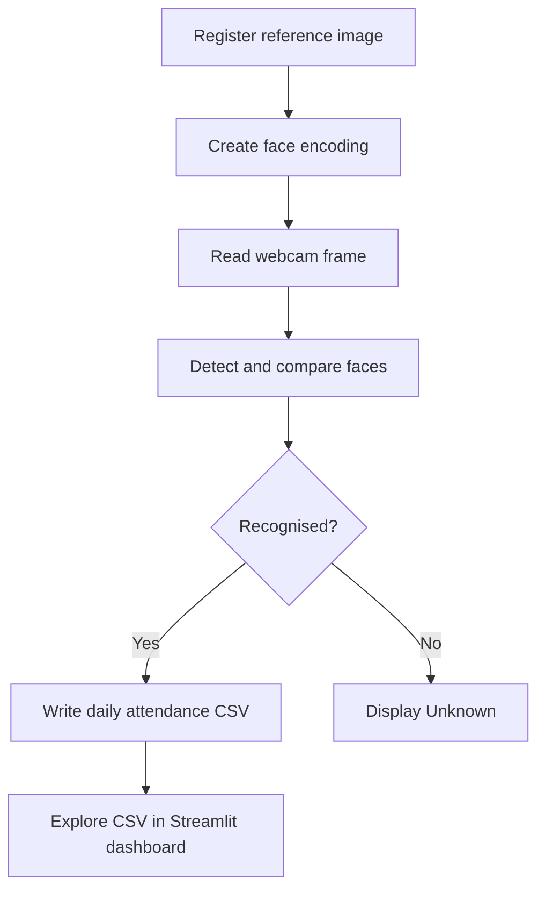

# Face Recognition Attendance System

[](https://github.com/yashrajadsul165/Face-Recognition-Attendance-System/actions/workflows/python-checks.yml)
[](https://www.python.org/)
[](LICENSE)

A working Python application that recognises registered faces through a webcam and records attendance automatically in a daily CSV file.

## Features

- Registers a person from one clear reference image
- Validates that the reference image contains exactly one face
- Detects and recognises faces from a live webcam
- Draws a name label around recognised faces
- Records name, date, time and face distance in CSV format
- Prevents duplicate attendance for the same person on the same day
- Provides an interactive Streamlit dashboard for attendance analysis
- Supports CSV upload, filters, charts and filtered-data download
- Keeps personal face images and attendance records out of Git
- Includes unit tests and automated GitHub checks

## How it works



## Project structure

```text
Face-Recognition-Attendance-System/
├── app.py                       # Registration and attendance application
├── known_faces/                 # Local reference images (not committed)
├── attendance/                  # Generated daily CSV files (not committed)
├── dashboard/                   # Streamlit dashboard and CSV validation
├── examples/sample_attendance.csv
├── tests/                       # Application and dashboard unit tests
├── requirements.txt
└── .github/workflows/           # Automated Python checks
```

## Requirements

- Python 3.10 or 3.11
- A webcam
- One clear, front-facing JPG or PNG image for each person

On Windows, the `face-recognition` dependency may also require CMake and Microsoft C++ Build Tools.

## Installation

```bash
git clone https://github.com/yashrajadsul165/Face-Recognition-Attendance-System.git
cd Face-Recognition-Attendance-System
python -m venv .venv
.venv\Scripts\activate
pip install -r requirements.txt
```

## Usage

### 1. Register a person

```bash
python app.py register --name "Yashraj Adsul" --image "C:\path\to\photo.jpg"
```

The image must contain exactly one clearly visible face. Use `--overwrite` if you intentionally want to replace an existing image.

### 2. Start attendance

```bash
python app.py run
```

Press `q` in the camera window to stop. If your system has multiple cameras, select one with:

```bash
python app.py run --camera 1
```

### 3. View the output

Attendance is saved locally as:

```text
attendance/attendance_YYYY-MM-DD.csv
```

Example:

| name | date | time | face_distance |
|---|---|---|---:|
| Demo User | 2026-07-16 | 10:30:00 | 0.3210 |

### 4. Explore the dashboard

Install the lightweight dashboard dependencies and start Streamlit:

```bash
pip install -r dashboard/requirements.txt
streamlit run dashboard/streamlit_app.py
```

Upload an attendance CSV or explore the included synthetic sample data. The
dashboard shows attendance totals, unique people, daily trends, per-person
counts and a downloadable filtered table. It never uploads face images.

## Run the tests

```bash
python -m unittest discover -s tests -v
```

The dashboard is deployment-ready on Streamlit Community Cloud. Select
`dashboard/streamlit_app.py` as the entrypoint; its adjacent requirements file
keeps the cloud deployment separate from the webcam dependencies.

## Privacy and limitations

- Obtain consent before registering or recognising anyone.
- Face images and generated attendance records are ignored by Git by default.
- Recognition accuracy changes with lighting, camera quality and face angle.
- Face distance is a similarity measure, not a probability or identity guarantee.
- The hosted dashboard analyses CSV records only; recognition runs locally.
- This student project should not be used as the only source of truth for high-stakes attendance decisions.

## Future improvements

- Store attendance in a database
- Add an administrator login
- Provide recognition confidence reports
- Support multiple classroom sessions

## Author

**Yashraj Adsul**

## License

This project is available under the [MIT License](LICENSE).
